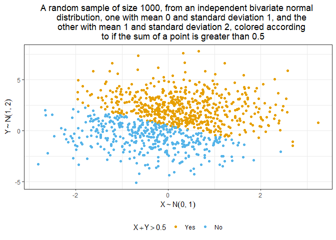

PubH7462 - Homework 1
================
Andrés Arguedas
2/2/2022

-   [Problem 2.1](#problem-21)
-   [Problem 2.2](#problem-22)
    -   [Data Description](#data-description)
    -   [Visualization](#visualization)

# Problem 2.1

``` r
sim_data <- tibble(
  x = rnorm(n = 1000, mean = 0, sd = 1),
  y = rnorm(n = 1000, mean = 1, sd = 2),
  sum_indicator = ifelse(x + y > 0.5, TRUE, FALSE)) %>% 
  mutate(indicator_TRUE = factor(sum_indicator,
                                 labels = c("No", "Yes")),
         indicator_TRUE = fct_relevel(indicator_TRUE, "Yes", "No"))
```

``` r
sim_data %>% ggplot(aes(x = x, y = y, col = indicator_TRUE)) +
  geom_point() +
  labs(title = "",
       x = "",
       y = "",
       col = "X + Y > 0.5")
```

<!-- -->

# Problem 2.2

To start, we need to load the data into R

``` r
# Read data with relative path
penguin.df <- read_rds("./data/penguin.RDS")
```

## Data Description

-   Observations: 344
-   Variables: 8
-   Mean flipper length: 200.9152 mm
-   Mean bill length: 43.9219 mm

## Visualization

``` r
penguin.df %>% ggplot(aes(y = flipper_length_mm, x = bill_length_mm, col = species)) +
  geom_point() +
  labs(title = "",
       x = "",
       y = "")
```

    ## Warning: Removed 2 rows containing missing values (geom_point).

<!-- -->

``` r
penguin.df %>% ggplot(aes(y = flipper_length_mm, x = bill_length_mm, col = species)) +
  facet_wrap(~ sex) +
  geom_point() +
  labs(title = "",
       x = "",
       y = "")
```

    ## Warning: Removed 2 rows containing missing values (geom_point).

<!-- -->
